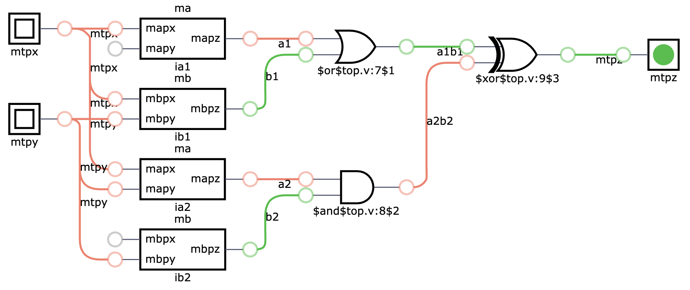

# Verilog estrutural, instanciando e conectando módulos

Implemente o circuito no arquivo `top.v` conforme a figura a abaixo e as instruções a seguir:

- Use os mesmos nomes para os fios, pois isso é importante para que o teste seja bem sucedido. 
- Observe os módulos `ma` e `mb` instanciados duas vezes cada um deles:
    - Faça as ligações **por posição** quando eles forem totalmente conectados (`ib1` e `ia2`);
    - Faça as ligações **por nome** quando eles tiverem portas desconectadas (`ia1` e `ib2`);
    - Use as **primitivas básicas** da linguagem Verilog ao invés `assign` para gerar as portas `and`, `or` e `xor` que aparecem no circuito.

# Referências

- https://hdlbits.01xz.net/wiki/Module
- https://hdlbits.01xz.net/wiki/Mt2015_q4
- https://www.chipverify.com/verilog/verilog-net-types
